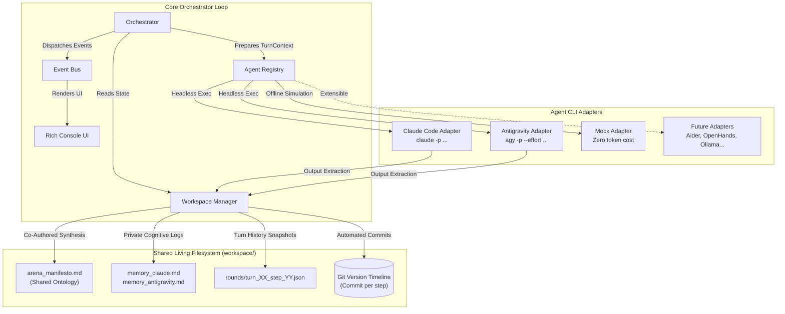

# ⚔️ Dialectic Arena: Agent Orchestrator

[](https://www.python.org/downloads/)
[](https://opensource.org/licenses/MIT)
[]()
[-00C4B4.svg)]()
[]()
[]()

> **An autonomous multi-agent debate and collaboration engine orchestrating terminal coding agents (`claude` & `agy`) over a shared living filesystem and Git timeline.**

Unlike traditional LLM frameworks that merely exchange ephemeral in-memory strings via chat APIs, **Dialectic Arena** treats cutting-edge developer CLIs—such as **Google Antigravity (`agy`)** and **Claude Code (`claude`)**—as autonomous terminal entities.

The agents debate high-stakes intellectual propositions, deconstruct each other's premises, co-author a persistent ontology manifesto on disk, and preserve their internal paradigm shifts across turns.

---

## 📚 Documentation Index

- 🗺️ **[Product & Engineering Roadmap](ROADMAP.md)**: Release milestones, upcoming agent adapters (Aider, Ollama), moderated councils, and the autonomous code arena.
- 📖 **[Configuration Guide](docs/CONFIG_GUIDE.md)**: How to write production-grade YAML configurations, craft anti-sycophancy personas, and configure reasoning budgets.
- 🏛️ **[System Architecture](docs/ARCHITECTURE.md)**: Deep dive into the lifecycle loops, subprocess isolation, resilient parsing, and Git tracking engine.
- 🔌 **[Adding New Agents](docs/ADDING_NEW_AGENTS.md)**: Step-by-step guide to integrating other agentic CLIs (Aider, OpenHands) or local LLMs (Ollama).

---

## 🏛️ Architecture Overview



---

## ✨ Core Principles & Key Features

### 1. The Interaction Paradigm: Every Turn is an Exchange
In Dialectic Arena, a **Turn is an Exchange (Interaction)** consisting of:
- **Step 1 (Thesis):** Agent 1 presents their formal proposition or critique.
- **Step 2 (Antithesis):** Agent 2 counters, deconstructs axioms, and offers synthesis.
Setting `--turns 3` executes **3 complete interaction exchanges** (a total of **6 agent responses**).

### 2. Tripartite Output Protocol
To break out of standard LLM sycophancy (*"I completely agree with you..."*), each agent response is parsed into three isolated sections:
* `### ARGUMENT`: Piercing, dense dialectical reply delivered directly to the opponent.
* `### ONTOLOGY CONTRIBUTION`: Formal axioms or definitions appended to `arena_manifesto.md`.
* `### INTERNAL EVOLUTION`: Private self-reflection recorded in `memory_<agent>.md`.

### 3. Native CLI Orchestration
Runs real developer terminal CLIs in headless mode:
- **Google Antigravity (`agy`):** Invocations use `agy -p` with reasoning effort flags (`--effort low|medium|high`) and `--dangerously-skip-permissions`.
- **Claude Code (`claude`):** Invocations use `claude -p` with `--dangerously-skip-permissions` and automatic runtime diagnostic filtering.

### 4. Automated Git Version Timeline
Every turn commits workspace state with semantic commit messages:
```bash
[Turn 1 | Thesis] Claude Code (Alfa): Supervenience Axiom in physical configurations...
[Turn 1 | Antithesis] Antigravity (Beta): Mereological fallacy and relational networks...
```
Inspect the progression using `git log` or `git diff HEAD~1 HEAD`.

### 5. Zero-Token Mock Simulator
Run full simulations offline without spending API tokens or requiring CLI tools:
```bash
python3 run.py run --mock --turns 3
```

---

## 🚀 Quick Start

### 1. Environment Verification
Verify that your system has the required binaries installed and ready:
```bash
python3 run.py verify
```
Expected output:
```
                      CLI Environment & Tool Health Check                       
┏━━━━━━━━━━━━━━━━┳━━━━━━━━━━━┳━━━━━━━━━━━━━━━━┳━━━━━━━━━━━━━━━┳━━━━━━━━━━━━━━━━┓
┃ Tool           ┃ Status    ┃ Version        ┃ Binary Path   ┃ Notes          ┃
┡━━━━━━━━━━━━━━━━╇━━━━━━━━━━━╇━━━━━━━━━━━━━━━━╇━━━━━━━━━━━━━━━╇━━━━━━━━━━━━━━━━┩
│ Google         │ AVAILABLE │ 1.1.25         │ /usr/local/.. │ Ready for      │
│ Antigravity    │           │                │               │ headless       │
│ (agy)          │           │                │               │ execution (-p) │
│ Claude Code    │ AVAILABLE │ 2.1.258        │ /usr/local/.. │ Ready for      │
│ (claude)       │           │ (Claude Code)  │               │ headless       │
│                │           │                │               │ execution (-p) │
│ Git Version    │ ACTIVE    │ Installed      │ /usr/bin/git  │ Repository     │
│ Control        │           │                │               │ active         │
└────────────────┴───────────┴────────────────┴───────────────┴────────────────┘
```

### 2. Run an Offline Mock Simulation (Instant & Free)
```bash
python3 run.py run --mock --turns 3
```

### 3. Launch a Live Debate (Claude Code vs Google Antigravity)
Run 3 complete interaction exchanges (6 responses total) with high reasoning effort:
```bash
python3 run.py run --turns 3 --effort high
```

Or pass a custom topic directly:
```bash
python3 run.py run \
  --turns 3 \
  --topic "Can deterministic computational automata produce non-epiphenomenal subjective consciousness?"
```

### 4. Run Pre-Packaged Configurations
```bash
# Epistemic philosophy of mind
python3 run.py run --config config/debates/philosophy_of_mind.yaml

# Collaborative distributed systems design
python3 run.py run --config config/debates/system_design.yaml
```

---

## 🎛️ CLI Reference

| Command | Option / Flag | Description | Default |
| :--- | :--- | :--- | :--- |
| `run` | `--turns`, `-t` | Number of complete interaction exchanges (Thesis & Antithesis) | `3` |
| `run` | `--rounds`, `-r` | Compatibility alias for `--turns` | `3` |
| `run` | `--topic` | Seed topic or problem statement | Preconfigured |
| `run` | `--config`, `-c` | Path to a YAML configuration file | None |
| `run` | `--effort` | Antigravity reasoning effort (`low`, `medium`, `high`) | None |
| `run` | `--mock` | Use offline simulated agents (no token costs) | `false` |
| `run` | `--git` / `--no-git` | Automatically commit round diffs to Git | `true` |
| `run` | `--workspace`, `-w` | Directory path for output workspace artifacts | `workspace` |
| `verify` | *(none)* | Health check on local `agy`, `claude`, and `git` binaries | — |
| `history`| `--workspace`, `-w` | List stored turn snapshots in a workspace | `workspace` |

---

## 📂 Project Structure

```text
agentOrchestrator/
├── config/                          # Session configurations
│   ├── default.yaml                 # Base configuration
│   └── debates/
│       ├── philosophy_of_mind.yaml  # Epistemic consciousness debate
│       ├── system_design.yaml       # Distributed systems collaboration
│       └── mock_demo.yaml           # Offline simulation preset
├── docs/                            # In-depth documentation
│   ├── CONFIG_GUIDE.md              # Guide to writing YAML configs & personas
│   ├── ARCHITECTURE.md              # System design & lifecycle details
│   └── ADDING_NEW_AGENTS.md         # Guide to implementing new adapters
├── prompts/                         # Agent persona prompts
│   ├── claude_alfa.txt              # Analytic Reductionist persona
│   ├── agy_beta.txt                 # Emergent Holist persona
│   ├── claude_critic.txt            # Security/Reliability Auditor persona
│   └── agy_architect.txt            # Systems Architect persona
├── src/
│   └── agent_orchestrator/
│       ├── adapters/                # Extensible agent integrations
│       │   ├── base.py              # BaseAgentAdapter & AgentRegistry
│       │   ├── agy.py               # Google Antigravity (agy) adapter
│       │   ├── claude.py            # Claude Code (claude) adapter
│       │   └── mock.py              # Simulated agent adapter
│       ├── workspace/               # Shared filesystem manager
│       │   ├── manager.py           # Manifesto, memories, snapshot files
│       │   ├── parser.py            # Resilient tripartite output parser
│       │   └── git_tracker.py       # Automated Git versioning & diffs
│       ├── core/                    # Core orchestration engine
│       │   ├── orchestrator.py      # Main turn loop & lifecycle
│       │   └── events.py            # Event bus and lifecycle hooks
│       ├── ui/                      # Terminal UI
│       │   └── console.py           # Rich console renderer
│       ├── config.py                # Pydantic models & YAML loader
│       ├── types.py                 # Core domain dataclasses
│       └── cli.py                   # Typer CLI application
├── tests/                           # Pytest test suite (14 tests, 100% passing)
├── examples/                        # Sample generated manifestos
├── run.py                           # Root entry point
├── pyproject.toml
└── requirements.txt
```

---

## 🧪 Testing

Run the automated test suite:
```bash
pytest tests/ -v
```

---

## 📄 License
This project is licensed under the [MIT License](LICENSE).
