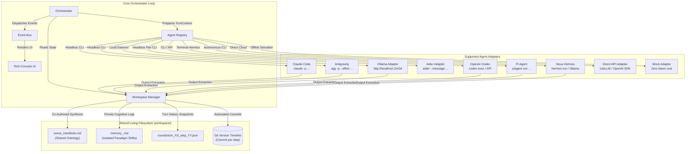

# Dialectic Arena: Multi-Agent Orchestrator

[](https://www.python.org/downloads/)
[](https://opensource.org/licenses/MIT)
[]()
[-00C4B4.svg)]()
[]()
[]()
[]()
[]()
[]()
[]()
[]()

> **An autonomous multi-agent debate and collaboration engine orchestrating terminal coding agents (`claude`, `agy`, `ollama`, `aider`, `codex`, `piagent`, `hermes`, and APIs) over a shared living filesystem, automated Git timeline, and consensus convergence scoring.**

Unlike conventional LLM wrappers that merely exchange ephemeral in-memory strings via chat endpoints, **Dialectic Arena** treats developer CLIs and local execution runtimes as first-class autonomous processes.

Agents debate structured propositions, deconstruct opposing premises, co-author a persistent ontology manifesto on disk, and record their internal paradigm shifts across turns.

---

## Documentation Index

- **[Product & Engineering Roadmap](ROADMAP.md)**: Technical milestones, completed adapters, and planned releases.
- **[Configuration Guide](docs/CONFIG_GUIDE.md)**: Authoring YAML configurations, anti-sycophancy personas, and execution budgets.
- **[System Architecture](docs/ARCHITECTURE.md)**: Deep dive into the turn lifecycle, process isolation, output parsing, and Git persistence.
- **[Adding New Agents](docs/ADDING_NEW_AGENTS.md)**: Interface specifications and blueprints for custom agent adapters.

---

## Architecture Overview



---

## Core Principles & System Design

### 1. Interaction Paradigm: Each Turn is a Complete Exchange
In Dialectic Arena, a **Turn is an Exchange** rather than a single utterance:
- **Mode `ping_pong`:** Turn $N$ comprises **Step 1 (Thesis)** and **Step 2 (Antithesis)**.
- **Mode `moderated`:** Turn $N$ comprises **Step 1 (Thesis)**, **Step 2 (Antithesis)**, and **Step 3 (Synthesis & Moderation)**.
Configuring `--turns 3` in two-agent mode executes 3 complete interaction cycles (6 agent responses total).

### 2. Tripartite Output Protocol
To systematically eliminate sycophancy, each agent output is parsed into three isolated sections:
- `### ARGUMENT`: Direct, substantive counter-argument delivered to the opponent.
- `### ONTOLOGY CONTRIBUTION`: Formal axioms, theorems, or definitions appended to `arena_manifesto.md`.
- `### INTERNAL EVOLUTION`: Private reflections on cognitive shifts, recorded in `memory_<agent>.md`.

### 3. Subprocess & Local Runtime Orchestration
Executes developer CLIs and local services in headless mode:
- **Google Antigravity (`agy`):** Invoked via `agy -p` with reasoning effort flags (`--effort low|medium|high`) and `--dangerously-skip-permissions`.
- **Claude Code (`claude`):** Invoked via `claude -p` with `--dangerously-skip-permissions` and diagnostic log filtering.
- **Ollama Local (`ollama`):** Direct HTTP API integration for 100% private, offline inference with open-weight models (`gemma4`, `deepseek-r1`, `llama3.3`).
- **Aider CLI (`aider`):** Headless pair-programming integration (`--message`, `--no-auto-commits`, `--yes-always`).
- **OpenAI Codex (`codex`):** Execution via `codex` CLI or direct API fallback with code-specialized models.
- **Pi Agent (`piagent`):** Lightweight terminal autonomous coding harness integration (`piagent run --headless`).
- **Nous Hermes (`hermes`):** Nous Research Hermes Agent CLI integration and local/cloud Hermes model endpoints.

### 4. The Moderated Council (`mode: "moderated"`)
Supports three-agent dialectic governance:
- **Step 1 (Thesis):** Proponent formulates the analytical proposition.
- **Step 2 (Antithesis):** Opponent deconstructs the thesis and counters with systemic holism.
- **Step 3 (Synthesis & Moderation):** Arbiter receives the aggregated transcript of both agents, flags fallacies, synthesizes agreed-upon propositions into `arena_manifesto.md`, and injects a destabilizing paradox to steer the subsequent turn.

### 5. Automated Git Version Timeline
Every turn commits workspace state with semantic commit messages:
```bash
[Turn 1 | Thesis] Claude Code (Alfa): Supervenience Axiom in physical configurations...
[Turn 1 | Antithesis] Antigravity (Beta): Mereological fallacy and relational networks...
[Turn 1 | Synthesis & Moderation] Arbiter: Synthesized mereological boundaries...
```
Inspect changes at any point:
```bash
git log -n 6 --oneline
git diff HEAD~1 HEAD
```

### 6. Zero-Token Offline Simulator
Execute simulations offline without token consumption or CLI binary dependencies:
```bash
python3 run.py run --mock --turns 3
```

### 7. Dynamic Persona Mutation (Self-Modifying Prompts)
When enabled (`--mutate-personas`), each agent's internal cognitive evolutions and philosophical concessions are persisted directly to `workspace/personas/<agent_id>.txt`. Subsequent interactions reload the mutated epistemic framework, allowing genuine philosophical convergence or paradigm drift across the debate.

### 8. Ontology Proposition Graph & Convergence Scoring
Automatically extracts propositions from `arena_manifesto.md` and evaluates their dialectic status:
- **Accepted:** Consensus reached and verified across dialogue statements.
- **Contested:** Active point of tension or ongoing deconstruction.
- **Refuted:** Formal fallacies or invalidated claims abandoned by consensus.

Generates a real-time mathematical alignment score ($0.0\%$ to $100.0\%$) and updates the shared manifesto document with progress indicators and structured proposition tables.

---

## Quick Start

### 1. Environment Verification
Verify that required tools and local services are available:
```bash
python3 run.py verify
```
Sample output:
```
                      CLI Environment & Tool Health Check                       
+-----------------------+---------------+---------------+---------------+
| Tool                  | Status        | Version       | Notes         |
+-----------------------+---------------+---------------+---------------+
| Google Antigravity    | AVAILABLE     | 1.1.25        | Headless -p   |
| Claude Code           | AVAILABLE     | 2.1.258       | Headless -p   |
| Ollama Local          | AVAILABLE     | Ollama API    | Offline runs  |
| Aider CLI             | NOT INSTALLED | N/A           | pip install   |
| OpenAI Codex          | AVAILABLE     | API / CLI     | Configured    |
| Pi Agent              | NOT INSTALLED | N/A           | npm install   |
| Nous Hermes           | AVAILABLE     | Hermes Agent  | Ready         |
| Git Version Control   | ACTIVE        | Installed     | Repo active   |
+-----------------------+---------------+---------------+---------------+
```

### 2. Run an Offline Mock Simulation
```bash
python3 run.py run --mock --turns 3
```

### 3. Launch a Live Debate (Claude Code vs Google Antigravity)
Execute 3 interaction exchanges (6 responses total) with high reasoning effort:
```bash
python3 run.py run --turns 3 --effort high
```

Or provide a custom seed topic:
```bash
python3 run.py run \
  --turns 3 \
  --topic "Can deterministic computational automata produce non-epiphenomenal subjective consciousness?"
```

### 4. Run Pre-Configured Presets
```bash
# Three-Agent Moderated Council (Thesis, Antithesis, Arbiter synthesis)
python3 run.py run --config config/debates/moderated_council.yaml

# 100% Offline Local Model debate via Ollama
python3 run.py run --config config/debates/ollama_local.yaml

# Epistemic philosophy of mind (Claude vs Antigravity)
python3 run.py run --config config/debates/philosophy_of_mind.yaml

# Collaborative distributed systems design
python3 run.py run --config config/debates/system_design.yaml
```

---

## Command-Line Reference

| Command | Option / Flag | Description | Default |
| :--- | :--- | :--- | :--- |
| `run` | `--turns`, `-t` | Number of complete interaction exchanges (Thesis & Antithesis) | `3` |
| `run` | `--rounds`, `-r` | Compatibility alias for `--turns` | `3` |
| `run` | `--topic` | Seed topic or problem statement | Preconfigured |
| `run` | `--config`, `-c` | Path to a YAML configuration file | None |
| `run` | `--effort` | Antigravity reasoning effort (`low`, `medium`, `high`) | None |
| `run` | `--mock` | Use offline simulated agents (no token costs) | `false` |
| `run` | `--git` / `--no-git` | Automatically commit turn diffs to Git | `true` |
| `run` | `--workspace`, `-w` | Directory path for output workspace artifacts | `workspace` |
| `run` | `--mutate-personas` | Evolve persona prompts dynamically across turns | `false` |
| `run` | `--convergence` | Analyze and score dialectic consensus convergence | `true` |
| `verify` | *(none)* | Health check on local `agy`, `claude`, `ollama`, `aider`, `codex`, `piagent`, `hermes`, and `git` | — |
| `history`| `--workspace`, `-w` | List stored turn snapshots in a workspace | `workspace` |
| `help` | `[COMMAND]` | Display command usage, options, and quick-start examples | — |

---

## Project Structure

```text
agentOrchestrator/
├── config/                          # Session configurations
│   ├── default.yaml                 # Base configuration
│   └── debates/
│       ├── moderated_council.yaml   # Three-agent council with Arbiter
│       ├── ollama_local.yaml        # Offline local open-weight model debate
│       ├── philosophy_of_mind.yaml  # Epistemic consciousness debate
│       ├── system_design.yaml       # Distributed systems collaboration
│       └── mock_demo.yaml           # Offline simulation preset
├── docs/                            # In-depth documentation
│   ├── CONFIG_GUIDE.md              # Guide to writing YAML configs & personas
│   ├── ARCHITECTURE.md              # System design & lifecycle details
│   └── ADDING_NEW_AGENTS.md         # Guide to implementing new adapters
├── prompts/                         # Agent persona prompts
│   ├── claude_alfa.txt              # Analytic Reductionist persona
│   ├── agy_beta.txt                 # Emergent Holist persona
│   ├── moderator_persona.txt        # Dialectic Arbiter & Synthesizer persona
│   ├── claude_critic.txt            # Security/Reliability Auditor persona
│   └── agy_architect.txt            # Systems Architect persona
├── src/
│   └── agent_orchestrator/
│       ├── adapters/                # Extensible agent integrations
│       │   ├── base.py              # BaseAgentAdapter & AgentRegistry
│       │   ├── agy.py               # Google Antigravity (agy) adapter
│       │   ├── claude.py            # Claude Code (claude) adapter
│       │   ├── ollama.py            # Ollama local model adapter
│       │   ├── aider.py             # Aider CLI coding adapter
│       │   ├── api.py               # Direct cloud API adapter
│       │   └── mock.py              # Simulated agent adapter
│       ├── workspace/               # Shared filesystem manager
│       │   ├── manager.py           # Manifesto, memories, snapshot files
│       │   ├── parser.py            # Resilient tripartite output parser
│       │   └── git_tracker.py       # Automated Git versioning & diffs
│       ├── core/                    # Core orchestration engine
│       │   ├── orchestrator.py      # Main turn loop & lifecycle
│       │   └── events.py            # Event bus and lifecycle hooks
│       ├── ui/                      # Terminal UI
│       │   └── console.py           # Rich console renderer
│       ├── config.py                # Pydantic models & YAML loader
│       ├── types.py                 # Core domain dataclasses
│       └── cli.py                   # Typer CLI application
├── tests/                           # Pytest test suite (18 tests, 100% passing)
├── examples/                        # Sample generated manifestos
├── run.py                           # Root entry point
├── ROADMAP.md                       # Product roadmap and release tracking
├── pyproject.toml
└── requirements.txt
```

---

## Verification and Testing

Run the automated test suite:
```bash
pytest tests/ -v
```

---

## License
This project is licensed under the [MIT License](LICENSE).
