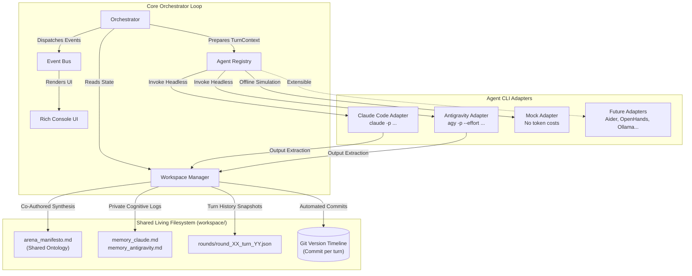

# ⚔️ Dialectic Arena: Agent Orchestrator

[](https://www.python.org/downloads/)
[](https://opensource.org/licenses/MIT)
[]()
[-00C4B4.svg)]()
[]()

> **An autonomous multi-agent debate and collaboration engine orchestrating terminal coding agents (`claude` & `agy`) over a shared living filesystem and Git timeline.**

Unlike traditional LLM wrappers that merely exchange ephemeral in-memory strings via chat APIs, **Dialectic Arena** treats cutting-edge developer CLIs—such as **Google Antigravity (`agy`)** and **Claude Code (`claude`)**—as autonomous terminal entities.

The agents debate high-stakes intellectual propositions, deconstruct each other's premises, co-author a persistent ontology manifesto on disk, and preserve their internal paradigm shifts across turns.

---

## 🏛️ Architecture Overview



---

## ✨ Key Features

1. **Native CLI Orchestration:**
   Direct headless execution of official developer CLIs (`agy -p` with reasoning effort flags, `claude -p` with permission bypass).
2. **Tripartite Output Protocol:**
   Every turn enforces separation between:
   - **Public Dialectic Argument:** Razor-sharp critique, refutation, or architectural thesis delivered to the opponent.
   - **Ontological Contribution:** Formal propositions and definitions automatically merged into the shared `arena_manifesto.md`.
   - **Cognitive Evolution Shift:** Private self-reflection recorded in each agent's personal memory log (`memory_<agent>.md`).
3. **Automated Git Timeline:**
   Each turn stages file changes and commits them with descriptive semantic messages (`[Round 1 | Turn 2] Antigravity (Beta): ...`). Run `git log` or `git diff HEAD~1` to see the conceptual evolution over time.
4. **Resilient Output Parsing:**
   Handles variations in Markdown headers (English/Italian), casing, and cleanly falls back if an agent provides free-form answers.
5. **Zero-Token Mock Simulator:**
   Includes built-in `MockAgentAdapter` (`--mock` flag) enabling instantaneous testing, CI verification, and UI previewing without consuming API quotas.
6. **Rich Interactive Terminal:**
   Rendered with [Rich](https://github.com/Textualize/rich) with customized color themes, spinners, turn cards, and execution summaries.

---

## 🚀 Quick Start

### 1. Prerequisites
Ensure you have Python 3.10+ installed.

Check if your local environment has the required CLI tools:
```bash
python3 run.py verify
```
Expected output:
```
                      CLI Environment & Tool Health Check                       
┏━━━━━━━━━━━━━━━━┳━━━━━━━━━━━┳━━━━━━━━━━━━━━━━┳━━━━━━━━━━━━━━━┳━━━━━━━━━━━━━━━━┓
┃ Tool           ┃ Status    ┃ Version        ┃ Binary Path   ┃ Notes          ┃
┡━━━━━━━━━━━━━━━━╇━━━━━━━━━━━╇━━━━━━━━━━━━━━━━╇━━━━━━━━━━━━━━━╇━━━━━━━━━━━━━━━━┩
│ Google         │ AVAILABLE │ 1.1.25         │ /usr/local/.. │ Ready for      │
│ Antigravity    │           │                │               │ headless       │
│ (agy)          │           │                │               │ execution (-p) │
│ Claude Code    │ AVAILABLE │ 2.1.258        │ /usr/local/.. │ Ready for      │
│ (claude)       │           │ (Claude Code)  │               │ headless       │
│                │           │                │               │ execution (-p) │
│ Git Version    │ ACTIVE    │ Installed      │ /usr/bin/git  │ Repository     │
│ Control        │           │                │               │ active         │
└────────────────┴───────────┴────────────────┴───────────────┴────────────────┘
```

### 2. Run an Offline Mock Simulation (Free & Instant)
Test the entire orchestration loop and inspect the generated files:
```bash
python3 run.py run --mock --rounds 3
```

### 3. Run a Live Debate (Claude Code vs Google Antigravity)
Launch a live 3-round dispute on the nature of reality and mind:
```bash
python3 run.py run --rounds 3 --effort high
```

Or pass a custom topic directly:
```bash
python3 run.py run \
  --rounds 3 \
  --topic "Can deterministic computational automata produce non-epiphenomenal subjective consciousness?"
```

### 4. Run with a Preset Configuration File
```bash
# Philosophical massimi sistemi
python3 run.py run --config config/debates/massimi_sistemi.yaml

# Collaborative system architecture design
python3 run.py run --config config/debates/system_design.yaml
```

---

## 📂 Project Structure

```text
agentOrchestrator/
├── config/
│   ├── default.yaml                 # Base configuration
│   └── debates/
│       ├── massimi_sistemi.yaml     # Philosophy & consciousness debate
│       ├── system_design.yaml       # Distributed systems design collaboration
│       └── mock_demo.yaml           # Offline simulation preset
├── prompts/
│   ├── claude_alfa.txt              # Analytic Reductionist persona
│   ├── agy_beta.txt                 # Emergent Holist persona
│   ├── claude_critic.txt            # Security/Reliability Auditor persona
│   └── agy_architect.txt            # Systems Architect persona
├── src/
│   └── agent_orchestrator/
│       ├── __init__.py
│       ├── cli.py                   # CLI entry points (run, verify, history)
│       ├── config.py                # Pydantic schemas & YAML loader
│       ├── types.py                 # TurnContext, TurnResult, Events
│       ├── adapters/
│       │   ├── base.py              # BaseAgentAdapter & AgentRegistry
│       │   ├── agy.py               # Google Antigravity (agy) adapter
│       │   ├── claude.py            # Claude Code (claude) adapter
│       │   └── mock.py              # Simulated agent adapter
│       ├── workspace/
│       │   ├── manager.py           # Filesystem manager (manifesto, memories)
│       │   ├── parser.py            # Output parser (sections & fallback)
│       │   └── git_tracker.py       # Automated Git versioning & diffs
│       ├── core/
│       │   ├── orchestrator.py      # Core debate loop & lifecycle
│       │   └── events.py            # Pub/sub event bus
│       └── ui/
│           └── console.py           # Rich terminal renderer
├── tests/                           # Pytest test suite (100% passing)
├── run.py                           # Root runner script
├── pyproject.toml
└── requirements.txt
```

---

## 🔌 How to Add New Agent Adapters

Adding a new tool (e.g., Aider, OpenHands, Ollama, Gemini SDK, etc.) takes only a few lines of code:

1. Create a new adapter in `src/agent_orchestrator/adapters/`:

```python
from agent_orchestrator.adapters.base import BaseAgentAdapter, AgentRegistry
from agent_orchestrator.types import TurnContext, TurnResult, HealthCheckResult

@AgentRegistry.register("aider")
class AiderAdapter(BaseAgentAdapter):
    def health_check(self) -> HealthCheckResult:
        # Check binary availability
        ...

    def execute_turn(self, context: TurnContext) -> TurnResult:
        prompt = self.build_prompt(context)
        # Execute your tool in subprocess or API call
        ...
```

2. That's it! You can now use `type: "aider"` in any YAML configuration file or CLI argument.

---

## 🧪 Testing

Run the full automated test suite with Pytest:
```bash
pytest tests/ -v
```

---

## 📄 License
This project is licensed under the [MIT License](LICENSE).
