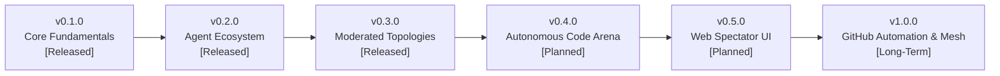

# Dialectic Arena: Product and Engineering Roadmap

This document outlines the architectural vision, release milestones, and development roadmap for the Dialectic Arena orchestrator.

---

## Release Milestones

### Version 0.1.0: Core Fundamentals & Dual CLI Orchestration (Released)
- [x] **Native CLI Execution:** Headless subprocess invocation for Google Antigravity (`agy`) and Claude Code (`claude`) with permission bypass.
- [x] **Interaction Semantics:** Every turn defined as a complete dialectic exchange (Thesis and Antithesis).
- [x] **Tripartite Output Protocol:** Robust parsing of `### ARGUMENT`, `### ONTOLOGY CONTRIBUTION`, and `### INTERNAL EVOLUTION`.
- [x] **Living Filesystem Workspace:** Persistent co-authored `arena_manifesto.md` and isolated cognitive logs (`memory_<agent>.md`).
- [x] **Automated Git Timeline:** Atomic Git commits executed per step with semantic commit messages and diff tracking.
- [x] **Zero-Token Simulator:** Built-in `MockAgentAdapter` for instantaneous offline dry runs and CI pipelines.
- [x] **Terminal UI:** Colored panels, turn banners, spinners, and structured summary metrics.
- [x] **Complete Test Suite:** 14/14 automated unit and integration tests passing in Pytest.
- [x] **Technical Documentation:** English documentation suite (`README.md`, `CONFIG_GUIDE.md`, `ARCHITECTURE.md`, `ADDING_NEW_AGENTS.md`).

---

### Version 0.2.0: Agent Ecosystem Expansion (Released)
*Objective: Expand beyond `claude` and `agy` to support the broader ecosystem of coding CLIs and local open-weight models.*

- [x] **Aider CLI Adapter (`aider`):**
  - Native integration with Aider in headless print mode (`--message`, `--no-auto-commits`, `--yes-always`).
  - Enables pairing Claude and Antigravity with open-source coding agents.
- [x] **Local Model Adapter via Ollama (`ollama`):**
  - Direct HTTP API communication with local Ollama daemon (`http://localhost:11434`).
  - Zero-token, private offline debates using local models (such as Gemma, DeepSeek-R1, Llama 3, and Qwen).
- [x] **OpenAI Codex Adapter (`codex`):**
  - CLI binary integration and direct API code generation fallback.
- [x] **Pi Agent Adapter (`piagent`):**
  - Minimalist terminal harness integration with Pi Agent CLI.
- [x] **Nous Hermes Adapter (`hermes`):**
  - Integration with Nous Research Hermes Agent CLI and local/cloud Hermes model inference.
- [x] **Direct Cloud API Fallbacks (`api` / `litellm`):**
  - Fallback adapters using LiteLLM/OpenAI SDKs for cloud inference without local CLI installations.
- [x] **Dynamic Environment Verification:**
  - Auto-detection and health checking of all 7 CLI tools and runtime daemons in `run.py verify`.

---

### Version 0.3.0: Advanced Dialectic Topologies & Moderated Councils (Released)
*Objective: Move beyond binary ping-pong into multi-agent governance and anti-sycophancy steering.*

- [x] **The Moderated Council (`mode: "moderated"`):**
  - Three-agent setup: Agent 1 (Thesis), Agent 2 (Antithesis), and Agent 3 (Moderator / Synthesizer).
  - The Moderator audits the exchange after each turn, detects logical fallacies, injects destabilizing paradoxes if consensus is reached prematurely, and drafts formal synthesis sections.
- [x] **Dynamic Persona Mutation (Self-Modifying Prompts):**
  - Agents evolve their epistemic personas across turns by persisting concessions, paradigm shifts, and tactical updates to `workspace/personas/<agent_id>.txt`.
  - In-memory adapters automatically reload evolved persona frameworks for subsequent interactions.
- [x] **Ontology Proposition Graph & Convergence Scoring:**
  - Automated classification of manifesto propositions: `Accepted`, `Contested`, or `Refuted` using sentence-level boundary extraction.
  - Real-time consensus convergence alignment score (0% to 100%) tracking intellectual consensus with dynamic visual ASCII indicators.

---

### Version 0.4.0: Autonomous Code & Security Arena (Planned)
*Objective: Transition from speculative philosophy to collaborative and adversarial software engineering.*

- [ ] **Adversarial Code Arena (Red Team vs. Blue Team):**
  - Task-driven coding sessions (e.g. implementing concurrency primitives or cryptographic relayers).
  - Agent 1 writes the implementation; Agent 2 writes property-based unit tests and fuzzing attacks; Agent 1 refactors and patches bugs until all tests pass.
- [ ] **Isolated Worktree Sandbox:**
  - Isolate each agent in distinct Git worktrees or containerized sandboxes to prevent filesystem race conditions.
- [ ] **Automated Test Runner Integration:**
  - Orchestrator automatically executes test suites (`pytest`, `cargo test`, `npm test`) between turns to objectively evaluate code quality.

---

### Version 0.5.0: Visual Spectator Web UI & Diff Viewer (Planned)
*Objective: Provide an interface for monitoring live multi-agent debates in real time.*

- [ ] **Real-Time Web Dashboard:**
  - Web spectator UI (via FastHTML, Streamlit, or React/WebSockets).
  - Side-by-side terminal logs with syntax highlighting.
  - Live side-by-side Git diff viewer showing `arena_manifesto.md` evolving turn-by-turn.
- [ ] **Terminal Session Recording:**
  - Built-in command using `vhs` or `asciinema` to automatically capture demonstration recordings.
- [ ] **Export Engine:**
  - Export completed debate sessions to formatted PDF reports, standalone HTML pages, or Markdown summaries.

---

### Version 1.0.0: Autonomous Mesh & GitHub Bot (Long-Term)
*Objective: Embed the Dialectic Arena directly into software development workflows and issue trackers.*

- [ ] **GitHub Action Bot (`/debate` command):**
  - Trigger debates directly inside GitHub Issues (e.g. `/debate architectural-tradeoffs`).
  - Agents debate the issue and automatically post structured summaries.
- [ ] **Automated Pull Request Synthesis:**
  - Automatically open a Pull Request containing the co-authored specification or code implementation once consensus is reached.
- [ ] **Dynamic Agent Mesh:**
  - Support arbitrary N-agent topologies (star, ring, tournament-style elimination).

---

## Community & Contributions

Contributions are welcome across all areas of the roadmap. Priority areas for contributors:
- Implementing additional agent adapters (see [docs/ADDING_NEW_AGENTS.md](docs/ADDING_NEW_AGENTS.md)).
- Adding new structured debate presets in `config/debates/`.
- Enhancing terminal reporting themes, metrics, and event subscribers.
