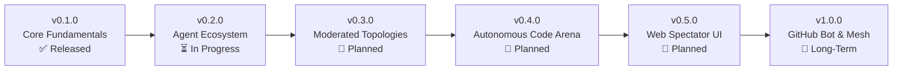

# 🗺️ Dialectic Arena: Product & Engineering Roadmap

This document outlines the strategic vision, upcoming milestones, and technical roadmap for **Dialectic Arena (Agent Orchestrator)**.

---

## 📍 Release Milestones

### ✅ v0.1.0: Core Fundamentals & Dual CLI Orchestration (Completed)
- [x] **Native CLI Execution:** Headless subprocess invocation for **Google Antigravity (`agy`)** and **Claude Code (`claude`)** with permission bypass.
- [x] **Interaction Semantics:** Every turn defined as a complete dialectic exchange (**Thesis & Antithesis**).
- [x] **Tripartite Output Protocol:** Robust parsing of `### ARGUMENT`, `### ONTOLOGY CONTRIBUTION`, and `### INTERNAL EVOLUTION`.
- [x] **Living Filesystem Workspace:** Persistent co-authored `arena_manifesto.md` and isolated cognitive logs (`memory_<agent>.md`).
- [x] **Automated Git Timeline:** Atomic Git commits executed per step with semantic commit messages and diff tracking.
- [x] **Zero-Token Simulator:** Built-in `MockAgentAdapter` for instantaneous offline dry runs and CI pipelines.
- [x] **Rich Terminal UI:** Colored panels, turn banners, spinners, and structured summary metrics.
- [x] **Complete Test Suite:** 14/14 automated unit and integration tests passing in Pytest.
- [x] **Comprehensive Documentation:** Full English docs suite (`README.md`, `CONFIG_GUIDE.md`, `ARCHITECTURE.md`, `ADDING_NEW_AGENTS.md`).

---

### ⏳ v0.2.0: Agent Ecosystem Expansion (In Progress)
*Objective: Expand beyond `claude` and `agy` to support the broader ecosystem of coding CLIs and local open-weight models.*

- [ ] **Aider CLI Adapter (`aider`):**
  - Native integration with [Aider](https://aider.chat/) in headless print mode (`--message`, `--no-auto-commits`).
  - Allows pairing Claude/Antigravity with open-source models via Aider.
- [ ] **Local Model Adapter via Ollama (`ollama`):**
  - Direct HTTP API communication with local Ollama instances (`http://localhost:11434`).
  - Zero-token, 100% private offline debates using models like DeepSeek-R1, Llama 3.3, and Qwen 2.5 Coder.
- [ ] **Direct Cloud API Fallbacks (`api`):**
  - Optional fallback adapters using official SDKs (`google-genai`, `anthropic`, `openai`) for users who do not have CLI binaries installed locally.
- [ ] **Dynamic Adapter Discovery:**
  - Auto-detection of available CLI tools on system PATH during initialization.

---

### 📅 v0.3.0: Advanced Dialectic Topologies & Moderated Councils (Planned)
*Objective: Move beyond binary ping-pong into multi-agent governance and anti-sycophancy steering.*

- [ ] **The Moderated Council (`mode: "moderated"`):**
  - Three-agent setup: **Agent 1 (Thesis)** vs. **Agent 2 (Antithesis)** + **Agent 3 (Moderator / Synthesizer)**.
  - The Moderator audits the exchange after each turn, detects logical fallacies, injects destabilizing paradoxes if consensus is reached too easily, and drafts formal synthesis sections.
- [ ] **Dynamic Persona Mutation (Self-Modifying Prompts):**
  - Allow agents to append lessons, concessions, and tactical shifts directly back into their persona prompt files on disk.
- [ ] **Ontology Proposition Graph & Convergence Scoring:**
  - Automated classification of manifesto propositions: `Accepted`, `Contested`, or `Refuted`.
  - Real-time consensus convergence score (0% to 100%) tracking intellectual alignment.

---

### 📅 v0.4.0: Autonomous Code & Security Arena (Planned)
*Objective: Transition from speculative philosophy to collaborative and adversarial software engineering.*

- [ ] **Adversarial Code Arena (Red Team vs. Blue Team):**
  - Task-driven coding sessions (e.g., *"Implement a thread-safe distributed cache"*).
  - Agent 1 writes the implementation; Agent 2 writes property-based unit tests and fuzzing attacks; Agent 1 refactors and patches bugs until all tests pass.
- [ ] **Isolated Worktree Sandbox:**
  - Isolate each agent in distinct Git worktrees or containerized sandboxes to prevent filesystem race conditions.
- [ ] **Automated Test Runner Integration:**
  - Orchestrator automatically executes test suites (`pytest`, `cargo test`, `npm test`) between turns to objectively evaluate code quality.

---

### 📅 v0.5.0: Visual Spectator Web UI & Diff Viewer (Planned)
*Objective: Provide a visual, shareable interface for watching live multi-agent debates.*

- [ ] **Real-Time Web Dashboard:**
  - Modern web spectator UI (via FastHTML, Streamlit, or React/WebSockets).
  - Side-by-side terminal logs with syntax highlighting.
  - Live side-by-side Git diff viewer showing `arena_manifesto.md` evolving turn-by-turn.
- [ ] **One-Click Terminal Recording:**
  - Built-in `run.py record` command using `vhs` or `asciinema` to automatically generate animated demonstration GIFs for sharing.
- [ ] **Export Engine:**
  - Export completed debate sessions to styled PDF reports, standalone HTML pages, or Markdown summaries.

---

### 🎯 v1.0.0: Autonomous Mesh & GitHub Bot (Long-Term)
*Objective: Embed the Dialectic Arena directly into software development workflows and issue trackers.*

- [ ] **GitHub Action Bot (`/debate` command):**
  - Trigger debates directly inside GitHub Issues (e.g., comment `/debate architectural-tradeoffs`).
  - Agents debate the issue and automatically comment with a structured summary.
- [ ] **Automated Pull Request Synthesis:**
  - Automatically open a Pull Request containing the co-authored specification or code implementation once consensus is reached.
- [ ] **Dynamic Agent Mesh:**
  - Support arbitrary N-agent topologies (star, ring, tournament-style elimination).

---

## 🤝 Community & Contributions

We welcome contributions across all areas of the roadmap! Priority areas for new contributors:
- Implementing new agent adapters (see [docs/ADDING_NEW_AGENTS.md](docs/ADDING_NEW_AGENTS.md)).
- Adding new debate presets in `config/debates/`.
- Enhancing console reporting themes and metrics.
