# 🏛️ Dialectic Arena: System Architecture

This document details the core architectural design, lifecycle loops, state persistence models, and adapter abstractions of the **Dialectic Arena (Agent Orchestrator)**.

---

## 1. High-Level Architectural Diagram

```mermaid
sequenceDiagram
    autonumber
    participant Orch as Orchestrator Loop
    participant WM as Workspace Manager
    participant Bus as Event Bus
    participant UI as Rich Console UI
    participant Claude as Claude Code (claude -p)
    participant AGY as Antigravity (agy -p)
    participant Git as Git Tracker

    Note over Orch,Git: Initialization
    Orch->>WM: Initialize workspace (topic.md, manifesto, memories)
    Orch->>Git: Ensure Git repo initialized
    Orch->>Bus: Emit ARENA_START
    Bus->>UI: Render Session Header Panel

    loop For Turn = 1 to N (Exchange: Thesis & Antithesis)
        Orch->>Bus: Emit TURN_START (Turn N)
        Bus->>UI: Print Turn Banner

        %% Step 1: Thesis (Claude Code)
        rect rgb(40, 20, 40)
            Note over Orch,Claude: Step 1: Thesis (Agent 1)
            Orch->>WM: Read current manifesto & memory_claude.md
            Orch->>Claude: Invoke subprocess `claude -p <prompt> --dangerously-skip-permissions`
            Claude-->>Orch: Return stdout with Tripartite sections
            Orch->>WM: Extract & append Ontology Contribution to arena_manifesto.md
            Orch->>WM: Extract & append Cognitive Evolution to memory_claude.md
            Orch->>WM: Save JSON turn snapshot
            Orch->>Git: git add & git commit "[Turn N | Thesis] Claude: ..."
            Orch->>Bus: Emit STEP_COMPLETE
            Bus->>UI: Render Agent 1 Output Panel & Git Commit Badge
        end

        %% Step 2: Antithesis (Antigravity)
        rect rgb(20, 40, 50)
            Note over Orch,AGY: Step 2: Antithesis (Agent 2)
            Orch->>WM: Read updated manifesto & memory_antigravity.md
            Orch->>AGY: Invoke subprocess `agy -p <prompt> --effort high --dangerously-skip-permissions`
            AGY-->>Orch: Return stdout with Tripartite sections
            Orch->>WM: Extract & append Ontology Contribution to arena_manifesto.md
            Orch->>WM: Extract & append Cognitive Evolution to memory_antigravity.md
            Orch->>WM: Save JSON turn snapshot
            Orch->>Git: git add & git commit "[Turn N | Antithesis] Antigravity: ..."
            Orch->>Bus: Emit STEP_COMPLETE
            Bus->>UI: Render Agent 2 Output Panel & Git Commit Badge
        end

        Orch->>Bus: Emit TURN_COMPLETE (Turn N)
    end

    Orch->>Bus: Emit ARENA_COMPLETE
    Bus->>UI: Render Final Summary Table
```



---

## 2. Core Concepts & Invariants

### A. Turn vs. Step Semantics
In casual conversation, "turn" is often overloaded. In Dialectic Arena:
- **A Turn is an Exchange (Interaction):** One complete dialectic cycle consisting of both a **Thesis** (Agent 1's proposition) and an **Antithesis** (Agent 2's deconstruction/counter-thesis).
- **A Step is an Individual Agent Move:** E.g., Turn 1.1 (Thesis by Claude), Turn 1.2 (Antithesis by Antigravity).
- Therefore, setting `--turns 3` generates **3 interaction cycles** and **6 total agent responses**.

### B. The Tripartite Output Protocol
To ensure intellectual progression, every prompt enforces three strictly delineated sections:
1. `### ARGUMENT`: The public dialectic reply directed at the opponent.
2. `### ONTOLOGY CONTRIBUTION`: Explicit definitions, axioms, or syntheses to be integrated into `arena_manifesto.md`.
3. `### INTERNAL EVOLUTION`: Private meta-reflections recording how the agent's internal framework adapted, appended to `memory_<agent_id>.md`.

### C. Resilient Parsing with Graceful Fallbacks (`OutputParser`)
LLMs do not always follow markdown formatting with 100% rigidity. The `OutputParser` employs a multi-tiered extraction strategy:
1. **Regex Section Matching:** Searches for case-insensitive headings (`### ARGUMENT`, `## ARGUMENT`, `### DIBATTITO`, etc.).
2. **Positional Fallback:** If section markers are missing or malformed, everything prior to any detected evolution marker is assigned to public dialogue.
3. **Zero-Crash Invariant:** The parser never throws unhandled exceptions on unexpected agent text.

---

## 3. Headless CLI Subprocess Execution

Unlike standard API calls that use HTTP REST/gRPC endpoints, Dialectic Arena runs real developer terminal CLIs:

### Google Antigravity (`agy`)
- **Invocation:** `agy -p "<prompt>"` (headless print mode).
- **Permissions:** `--dangerously-skip-permissions` bypasses interactive terminal tool confirmations.
- **Reasoning Effort:** `--effort [low|medium|high]` configures the Gemini reasoning budget.
- **Model Overrides:** Supports `--model <name>` for targeted model selection.

### Claude Code (`claude`)
- **Invocation:** `claude -p "<prompt>"`.
- **Permissions:** `--dangerously-skip-permissions` bypasses interactive approval prompts.
- **Log Sanitization:** Filters diagnostic runtime prefixes like `[claude-code:unrecognized_model]` before parsing stdout.

---

## 4. State Persistence & Living Filesystem

State is never kept solely in Python memory:
- **`workspace/topic.md`:** Immutable problem statement initialized at session start.
- **`workspace/arena_manifesto.md`:** The living, co-authored ontology document.
- **`workspace/memory_<agent_id>.md`:** Private cognitive shift logs per agent.
- **`workspace/rounds/turn_XX_step_YY_<agent_id>_<timestamp>.json`:** Reproducible structured turn snapshots.
- **Git Version Timeline:** Every turn executes an atomic git stage & commit:
  ```bash
  [Turn 1 | Thesis] Claude Code (Alfa): Supervenience Axiom in physical configurations...
  [Turn 1 | Antithesis] Antigravity (Beta): Mereological fallacy and relational networks...
  ```
  Inspect changes anytime with:
  ```bash
  git log -n 6 --oneline
  git diff HEAD~1 HEAD
  ```

---

## 5. Event Bus & Decoupled Architecture

The orchestrator does not directly invoke `print()` or handle formatting. Instead, it dispatches events to an `EventBus`:
- `ARENA_START` / `ARENA_COMPLETE`
- `TURN_START` / `TURN_COMPLETE`
- `STEP_START` / `STEP_COMPLETE`
- `MANIFESTO_UPDATED` / `MEMORY_UPDATED`
- `GIT_COMMITTED`
- `ERROR`

The `RichConsoleReporter` subscribes to these events and manages all styling, panels, and spinners. This clean separation enables easily attaching additional reporters in the future (e.g., WebSockets, JSON stream, Textual TUI, Discord webhooks).
