# Dialectic Arena: System Architecture

This technical specification details the architectural design, lifecycle loops, persistence models, and adapter abstractions of the Dialectic Arena orchestrator.

---

## 1. High-Level Architectural Diagram

```mermaid
sequenceDiagram
    autonumber
    participant Orch as Orchestrator Loop
    participant WM as Workspace Manager
    participant Bus as Event Bus
    participant UI as Rich Console UI
    participant Claude as Agent 1: Proponent (Thesis)
    participant AGY as Agent 2: Opponent (Antithesis)
    participant Arbiter as Agent 3: Arbiter (Synthesis)
    participant Git as Git Tracker

    Note over Orch,Git: Initialization
    Orch->>WM: Initialize workspace (topic.md, manifesto, memories)
    Orch->>Git: Ensure Git repo initialized
    Orch->>Bus: Emit ARENA_START
    Bus->>UI: Render Session Header Panel

    loop For Turn = 1 to N (Exchange: Thesis, Antithesis & Synthesis)
        Orch->>Bus: Emit TURN_START (Turn N)
        Bus->>UI: Print Turn Banner

        %% Step 1: Thesis
        rect rgb(40, 20, 40)
            Note over Orch,Claude: Step 1: Thesis (Proponent)
            Orch->>WM: Read current manifesto & memory
            Orch->>Claude: Invoke agent (claude, agy, ollama, aider, etc.)
            Claude-->>Orch: Return stdout with Tripartite sections
            Orch->>WM: Extract & append Ontology Contribution to arena_manifesto.md
            Orch->>WM: Extract & append Cognitive Evolution to memory
            Orch->>WM: Save JSON turn snapshot
            Orch->>Git: git add & git commit "[Turn N | Thesis] Agent 1: ..."
            Orch->>Bus: Emit STEP_COMPLETE
            Bus->>UI: Render Step Panel & Git Commit Badge
        end

        %% Step 2: Antithesis
        rect rgb(20, 40, 50)
            Note over Orch,AGY: Step 2: Antithesis (Opponent)
            Orch->>WM: Read updated manifesto & memory
            Orch->>AGY: Invoke agent with Agent 1's Thesis
            AGY-->>Orch: Return stdout with Tripartite sections
            Orch->>WM: Extract & append Ontology Contribution to arena_manifesto.md
            Orch->>WM: Extract & append Cognitive Evolution to memory
            Orch->>WM: Save JSON turn snapshot
            Orch->>Git: git add & git commit "[Turn N | Antithesis] Agent 2: ..."
            Orch->>Bus: Emit STEP_COMPLETE
            Bus->>UI: Render Step Panel & Git Commit Badge
        end

        %% Step 3: Synthesis & Moderation (in moderated mode)
        rect rgb(50, 45, 20)
            Note over Orch,Arbiter: Step 3: Synthesis & Moderation (Arbiter)
            Orch->>WM: Read updated manifesto
            Orch->>Arbiter: Invoke Arbiter with combined Thesis + Antithesis exchange
            Arbiter-->>Orch: Return synthesis, fallacy audit & next-turn paradox
            Orch->>WM: Append formal synthesis to arena_manifesto.md
            Orch->>WM: Save JSON turn snapshot
            Orch->>Git: git add & git commit "[Turn N | Synthesis & Moderation] Arbiter: ..."
            Orch->>Bus: Emit STEP_COMPLETE
            Bus->>UI: Render Step Panel & Git Commit Badge
        end

        Orch->>Bus: Emit TURN_COMPLETE (Turn N)
    end

    Orch->>Bus: Emit ARENA_COMPLETE
    Bus->>UI: Render Final Summary Table
```



---

## 2. Core Concepts & Invariants

### A. Turn vs. Step Semantics
In casual conversation, "turn" is often overloaded. In Dialectic Arena:
- **A Turn is an Exchange (Interaction):** One complete dialectic cycle.
  - In `mode: "ping_pong"`: Consists of **Step 1 (Thesis)** and **Step 2 (Antithesis)**.
  - In `mode: "moderated"`: Consists of **Step 1 (Thesis)**, **Step 2 (Antithesis)**, and **Step 3 (Synthesis & Moderation)**.
- **A Step is an Individual Agent Move:** E.g., Turn 1.1 (Thesis), Turn 1.2 (Antithesis), Turn 1.3 (Synthesis & Moderation).
- Therefore, setting `--turns 3` in moderated mode generates **3 interaction cycles** and **9 total agent responses**.

### B. The Tripartite Output Protocol
To ensure intellectual progression, every prompt enforces three strictly delineated sections:
1. `### ARGUMENT`: The public dialectic reply directed at the opponent (or synthesis delivered by Arbiter).
2. `### ONTOLOGY CONTRIBUTION`: Explicit definitions, axioms, or syntheses to be integrated into `arena_manifesto.md`.
3. `### INTERNAL EVOLUTION`: Private meta-reflections recording how the agent's internal framework adapted, appended to `memory_<agent_id>.md`.

### C. Resilient Parsing with Graceful Fallbacks (`OutputParser`)
LLMs do not always follow markdown formatting with 100% rigidity. The `OutputParser` employs a multi-tiered extraction strategy:
1. **Regex Section Matching:** Searches for case-insensitive headings (`### ARGUMENT`, `## ARGUMENT`, `### DIBATTITO`, etc.).
2. **Positional Fallback:** If section markers are missing or malformed, everything prior to any detected evolution marker is assigned to public dialogue.
3. **Zero-Crash Invariant:** The parser never throws unhandled exceptions on unexpected agent text.

---

## 3. Supported Adapter Execution Mechanics

Unlike standard API wrappers that only make HTTP calls, Dialectic Arena orchestrates real developer CLIs and local services:

### Google Antigravity (`agy`)
- **Invocation:** `agy -p "<prompt>"` (headless print mode).
- **Permissions:** `--dangerously-skip-permissions` bypasses interactive terminal tool confirmations.
- **Reasoning Effort:** `--effort [low|medium|high]` configures the Gemini reasoning budget.
- **Model Overrides:** Supports `--model <name>` for targeted model selection.

### Claude Code (`claude`)
- **Invocation:** `claude -p "<prompt>"`.
- **Permissions:** `--dangerously-skip-permissions` bypasses interactive approval prompts.
- **Log Sanitization:** Filters diagnostic runtime prefixes like `[claude-code:unrecognized_model]` before parsing stdout.

### Ollama Local Models (`ollama`)
- **Invocation:** Direct HTTP client to `http://localhost:11434/api/generate`.
- **Privacy & Cost:** 100% offline, zero token costs, air-gapped support.
- **Supported Models:** Gemma, DeepSeek-R1, Llama 3, Qwen, Mistral, etc.

### Aider CLI (`aider`)
- **Invocation:** `aider --message "<prompt>" --no-auto-commits --yes-always`.
- **Pair Programming:** Allows autonomous pair-programming tools to participate in structured dialectics.

### OpenAI Codex (`codex`)
- **Invocation:** `codex exec --prompt "<prompt>"` with direct OpenAI / LiteLLM API fallback.
- **Specialization:** Code synthesis, refactoring, and formal computational implementations.

### Pi Agent (`piagent`)
- **Invocation:** `piagent run --prompt "<prompt>" --headless --no-interactive`.
- **Architecture:** Minimalist thin-harness terminal platform executing local agentic tool loops.

### Nous Hermes Agent (`hermes`)
- **Invocation:** `hermes run --prompt "<prompt>" --non-interactive` or local/cloud Hermes inference endpoints.
- **Capabilities:** Autonomous reasoning agent framework with persistent memory and skill extraction.

### Direct API Fallback (`api`)
- **Invocation:** LiteLLM / OpenAI SDK completion.
- **Cloud Fallback:** Allows running the arena on remote instances where local CLI binaries are not installed.

---

## 4. State Persistence & Living Filesystem

State is never kept solely in Python memory:
- **`workspace/topic.md`:** Immutable problem statement initialized at session start.
- **`workspace/arena_manifesto.md`:** The living, co-authored ontology document.
- **`workspace/memory_<agent_id>.md`:** Private cognitive shift logs per agent.
- **`workspace/rounds/turn_XX_step_YY_<agent_id>_<timestamp>.json`:** Reproducible structured turn snapshots.
- **Git Version Timeline:** Every turn executes an atomic git stage & commit:
  ```bash
  [Turn 1 | Thesis] Claude Code (Alfa): Supervenience Axiom in physical configurations...
  [Turn 1 | Antithesis] Antigravity (Beta): Mereological fallacy and relational networks...
  ```
  Inspect changes anytime with:
  ```bash
  git log -n 6 --oneline
  git diff HEAD~1 HEAD
  ```

---

## 5. Event Bus & Decoupled Architecture

The orchestrator does not directly invoke `print()` or handle formatting. Instead, it dispatches events to an `EventBus`:
- `ARENA_START` / `ARENA_COMPLETE`
- `TURN_START` / `TURN_COMPLETE`
- `STEP_START` / `STEP_COMPLETE`
- `MANIFESTO_UPDATED` / `MEMORY_UPDATED`
- `PERSONA_MUTATED`
- `CONVERGENCE_EVALUATED`
- `GIT_COMMITTED`
- `ERROR`

The `RichConsoleReporter` subscribes to these events and manages all styling, panels, and spinners. This clean separation enables easily attaching additional reporters in the future (e.g., WebSockets, JSON stream, Textual TUI, Discord webhooks).

---

## 6. Dialectic Convergence & Proposition Classification Engine

The `ConvergenceAnalyzer` module (`src/agent_orchestrator/workspace/convergence.py`) extracts and tracks formal axioms, theorems, and claims across turns:
- **Extraction:** Identifies propositions from `arena_manifesto.md` headers and bullet points.
- **Classification:** Evaluates cross-agent dialogue history at the sentence level:
  - `Accepted`: Verified mutual agreement, citations, or shared ontological axioms.
  - `Contested`: Ongoing deconstruction, active points of tension, or irreconcilable premises.
  - `Refuted`: Explicit concessions of fallacies or abandoned claims.
- **Mathematical Alignment Formula:**
  $$\text{Score} = \min\left(100.0, \frac{\text{Accepted} \times 1.0 + \text{Refuted} \times 0.6}{\text{Total Propositions}} \times 100\right)$$
  *(Refutations contribute positively to consensus by acknowledging what has been formally falsified).*
- **Manifesto Embedding:** Injects a dynamic `## Dialectic Convergence Status` section into `arena_manifesto.md` with ASCII progress indicators and proposition status tables.

---

## 7. Dynamic Persona Mutation (Self-Modifying Prompts)

When `mutate_personas: true` is enabled:
1. **Workspace Sandboxing:** Initial personas are seeded to `workspace/personas/<agent_id>.txt` from config or prompt templates.
2. **Turn-by-Turn Adaptation:** When an agent produces an `### INTERNAL EVOLUTION` reflection containing paradigm shifts, concessions, or refined definitions, the orchestrator appends these cognitive shifts directly to the agent's dynamic persona file on disk.
3. **In-Memory Adapter Reload:** The in-memory adapter instance reloads the evolved identity via `adapter.update_persona()`, ensuring that subsequent turn prompts operate from the agent's evolved philosophical stance rather than a static starting prompt.
